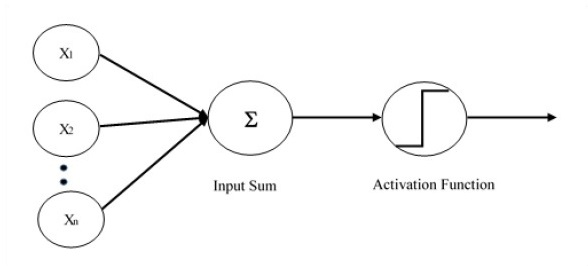

# Perceptron Demo
This project demonstrates the benefits and drawbacks of a simple single-layer perceptron. This was developed for the first lab project in our Computational Intelligence course. The perceptron architecture is as follows.

### Objective 
Implement a classifier for the characters L and I using the discrete perceptron learning algorithm. You may use any implementation, including the one in chapter 3 of *Machine Learning, an Algorithmic Perspective (2nd Edition)*.

### Requirements
1. Use a 3x3 binary matrix representation of the characters.
2. Create a training set (vectors representing versions of characters L and I) and train your classifier. Start with two input vectors, one for L and one for I. Then experiment by adding to the training set more vectors representing graphical variations of the two characters. 
3. Your neural network should have one neuron.
4. Create a test set using vectors not used for training and test your classifier. Compute the accuracy.
5. Experiment with different learning rates to observe how it influences the learning phase.
6. Repeat Steps 1-5 using a 5x5 binary representation.

### Deliverables
1. Report that answers the following questions:
    - Does your training always converge? If not, explain why.
    - When you increase the resolution of the matrix representation, will this improve the classification accuracy? Explain why.
    - Does the learning rate influence the learning phase? How?
2. The numerical results of your experiments and your conclusions.
3. Describe the implementation used.
4. Code

### Directory Structure
- doc: Any relevant documentation.
- img: Hosts any images for this README.
- out: Program output. 
- src: Program source code files.